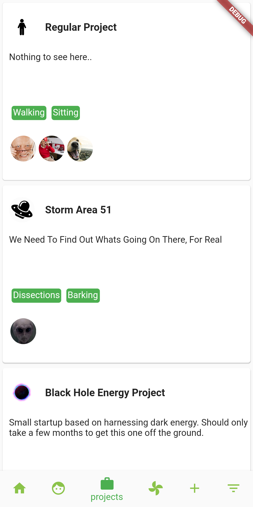
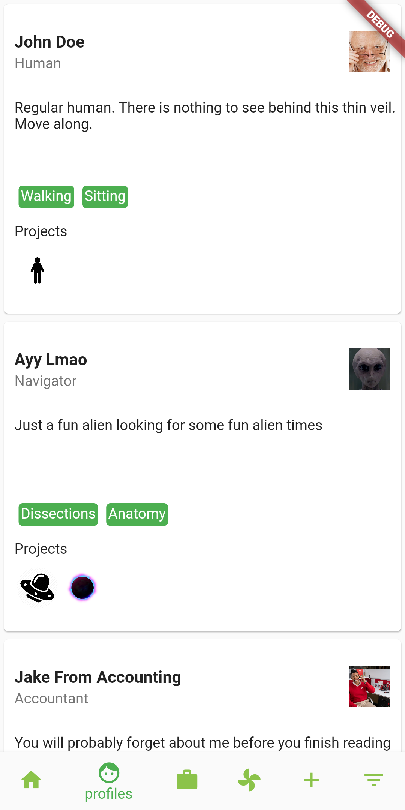
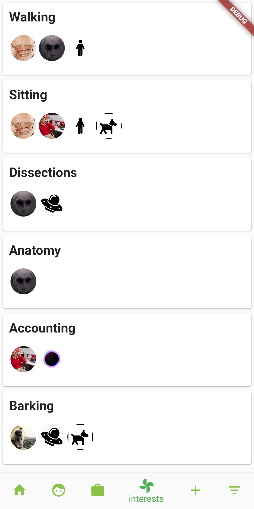
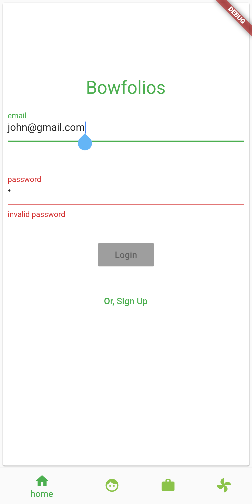
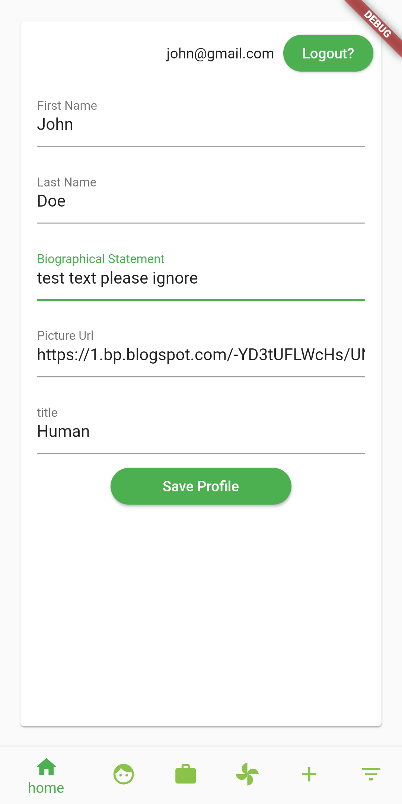
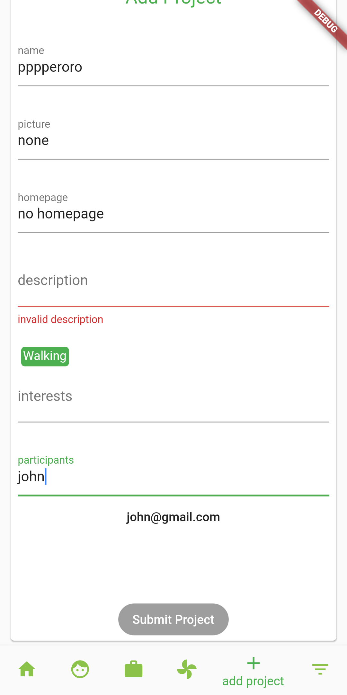
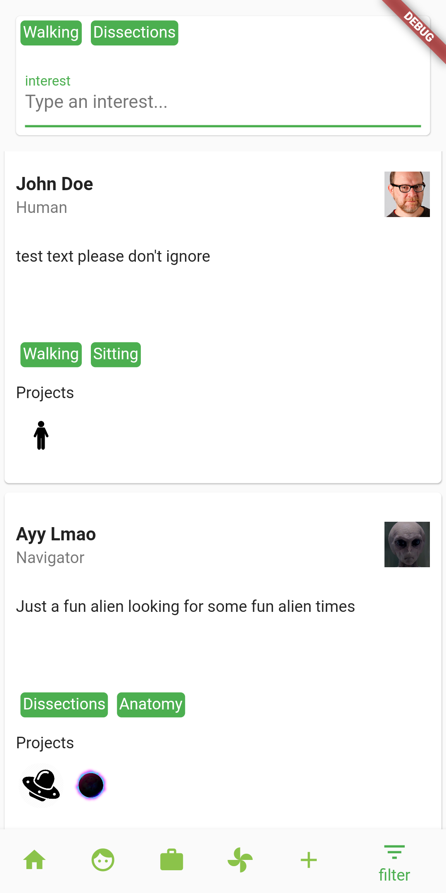

# Bowfolio Clone

Warm-up assignment for ICS491, based off of <https://bowfolios.github.io/>  

Bowfolio Clone is targeted at Android only at this time.  

This project is in development using Flutter, with Dart as the primary language.  
Other technologies currently in use are: [flutter_bloc](https://pub.dev/packages/flutter_bloc), [equatable](https://pub.dev/packages/equatable) and [formz](https://pub.dev/packages/formz).  

## Milestone 1  

- [x] Basic Modeling  
- [x] Views for each 'list' type, `Profiles`, `Projects` and `Interests`  

### Projects  

The `Projects` tab shows all the projects, as well as the pictures of the relevant people (or pups) working on them.  

  

### Profiles  

The `Profiles` tab shows the profile of each individual, as well as their interests and pictures for the projects they're working on.  

  

### Interests  

The `Interests` tab shows the interests of each profile and project.  

  

## Milestone 2  

- [x] Views for every page  
- [x] Authenticated user  

### User  

The `Home` tab has been converted into the login/landing page when opening the app. The `Add` and `Filter` tabs are now locked behind authentification.  

  

Once safely logged in, the `Home` tab transforms into a view asking the user to complete or edit their profile.  

  

### Add Project  

The `Add Project` now has a bit more lustre. Some amount of form validation is also included for every text box.  

  

### Filter  

`Filter` checks profiles against the given interests. If any of the interests match profiles, the filter shows them all.  

  

## Milestone 3  

- [ ] Link data to database  
- [ ] Clean views  
- [ ] Fix obvious bugs  

## Running the project  

Prerequisites: [Flutter/Flutter command line tools](https://flutter.dev/docs/get-started/install) and a connected Android device/simulator.  

*note*: Android Studio is not required. Simulators however do require a partial download as described on the Flutter install page.  

Running the command: `flutter doctor` can assist greatly in finding potential client-side issues.  

In a terminal, run the following commands:  

`git clone https://github.com/basic-account/bowfolio-clone.git`  

`cd bowfolio-clone`  

`flutter run`  
